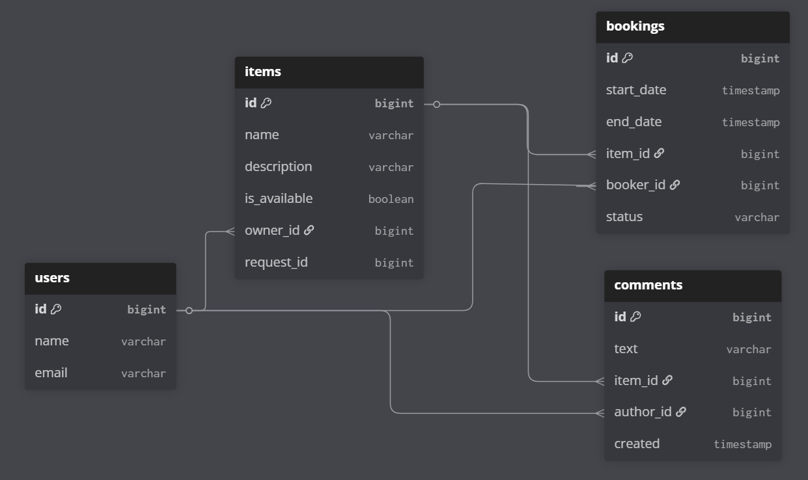

# java-shareit

### Описанные таблицы
- `users` — таблица пользователей
- `bookings` — таблица бронирований предметов
- `items` — таблица предметов
- `comments` — таблица комментариев к предметам после бронирований
- `requests` — таблица запросов предметов на случай, если заемщик не нашел предмет, который искал при поиске